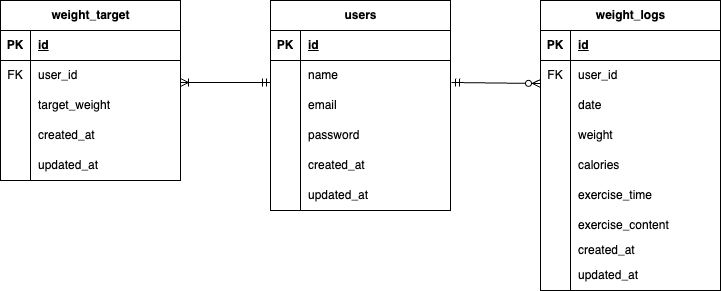

# PiGLy
## 環境構築

Dockerビルド

Git clone リンク

git clone https://

docker-compose up -d --build

## Laravel環境構築

docker-compose exec php　bash

composer install

.env ファイル設定、環境変数を以下のように変更  
DB_CONNECTION=mysql  
DB_HOST=mysql  
DB_PORT=3306  
DB_DATABASE=laravel_db  
DB_USERNAME=laravel_user  
DB_PASSWORD=laravel_pass  

php artisan key:generate

php artisan migrate

## 使用技術

PHP バージョン（ホスト環境）: 8.4.5 (Mac本体)

PHP バージョン（Dockerコンテナ内）: 8.3

Laravel バージョン: 8.83.29

MySQL バージョン: 8.0.26

## ER図 

## URL

環境開発 : http://localhost/weight_logs

phpMyAdmin : http://localhost:8080

テストユーザーログイン情報 : 
メールアドレス: test@example.com  
パスワード: password  
シーディングはエラーの為未実行  
